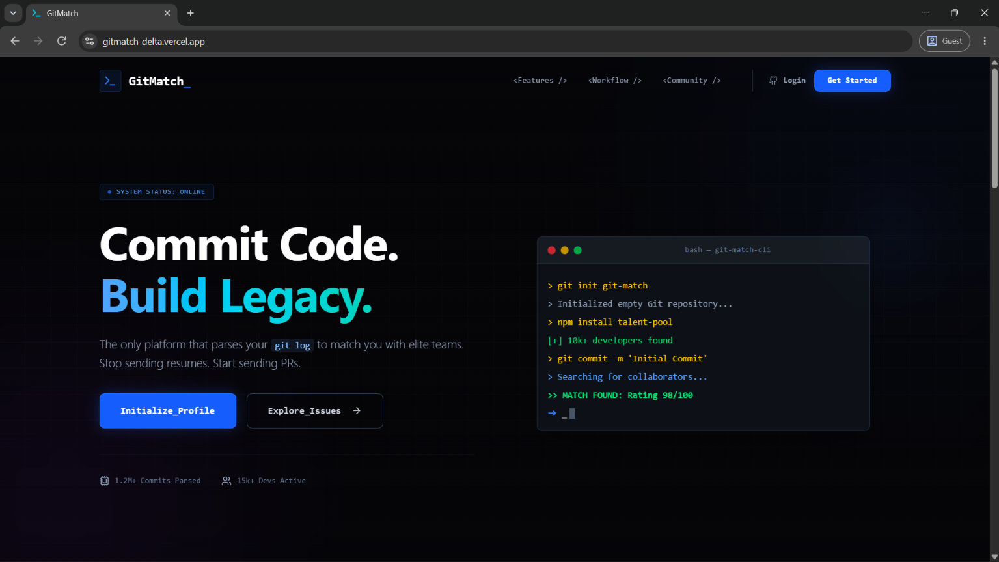
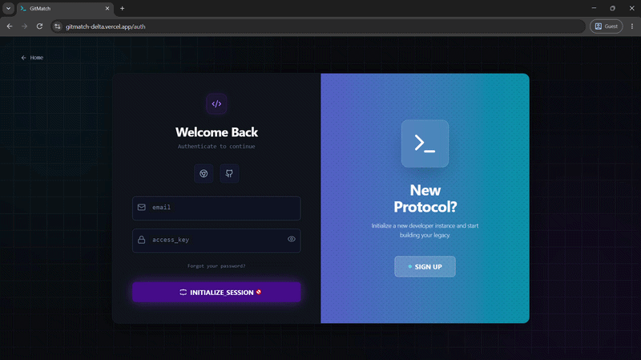
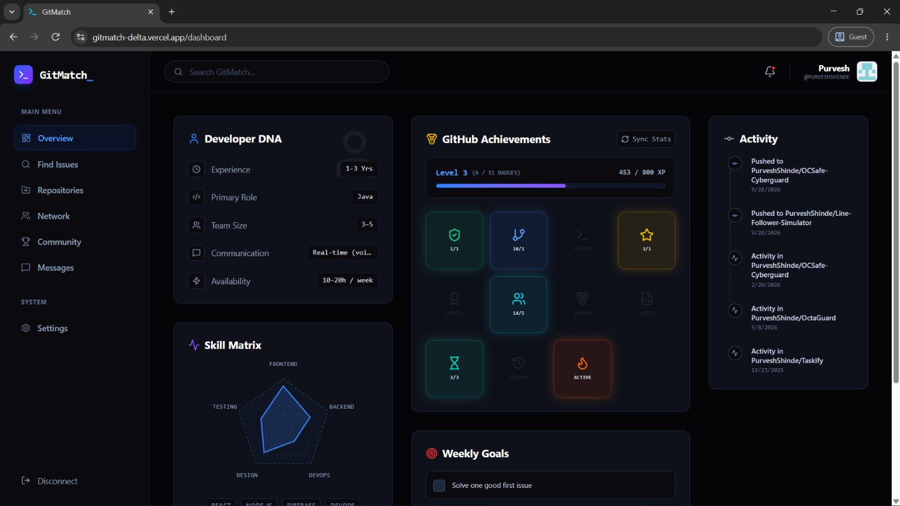
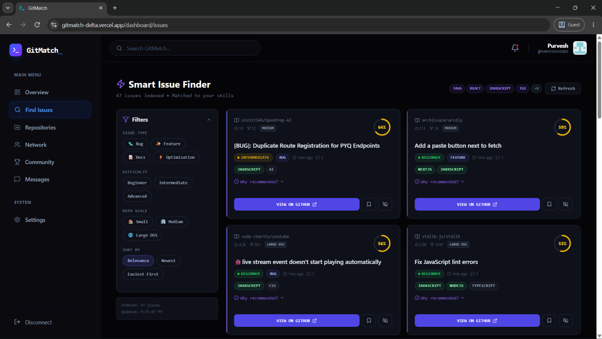
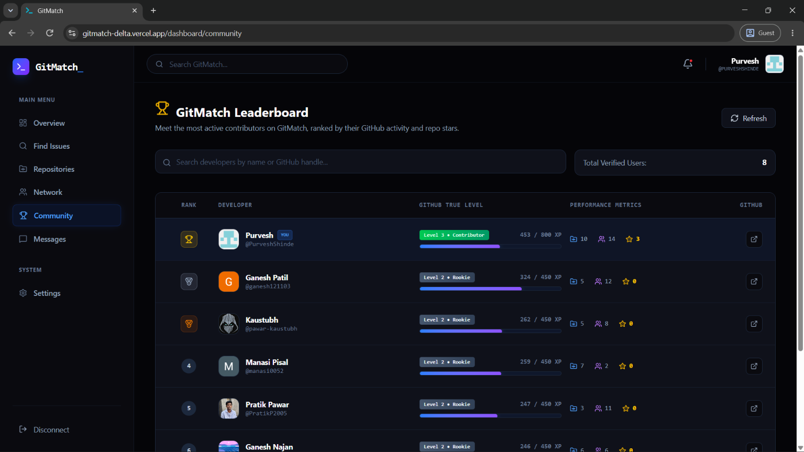

  

<h1 align="center">🚀 GitMatch</h1>

  <strong>Commit Code. Build Legacy.</strong> 
  The platform that parses your <code>git log</code> to match you with elite teams.

  

  
  
  
  
  

---

## 📖 What is GitMatch?

Getting into **open-source contribution** is hard for new developers. You don't know which projects need help, which issues match your skills, or who to collaborate with. **GitMatch solves this.**

GitMatch connects to your GitHub account, analyzes your skills, repositories, and activity — then **intelligently recommends open-source issues** you're best suited to work on. It also connects you with like-minded developers for collaboration through real-time chat, tracks your progress with XP and achievement badges, and ranks contributors on a community leaderboard.

> Stop sending resumes. Start sending PRs.

---

## 📸 Screenshots

### 🏠 Landing Page

  

A developer-themed landing page with a terminal animation that showcases how GitMatch works — from initializing your profile to finding your perfect match.

---

### 🔐 Authentication

  

Sign up with email, Google, or GitHub. Email verification and password reset flows are built-in. Link your GitHub account during onboarding to unlock all features.

---

### 📊 Dashboard — Developer DNA & Achievements

  

Your personalized dashboard shows:
- **Developer DNA** — Experience level, primary role, team size preference, and availability
- **Skill Matrix** — Radar chart visualizing your strengths across Frontend, Backend, DevOps, Design, and Testing
- **GitHub Achievements** — Unlock badges as you grow (Level 3 • Contributor, and 11 badges to earn)
- **Activity Feed** — Live feed of your recent GitHub pushes and contributions
- **Weekly Goals** — Track personal milestones like "Solve one good first issue"

---

### ⚡ Smart Issue Finder

  

The core feature — a **skill-based issue recommendation engine** that:
- Scans open-source repositories and indexes real GitHub issues
- Shows a **match percentage** (e.g., 64%, 59%) based on how well the issue fits your skills
- Filters by **Issue Type** (Bug, Feature, Docs, Optimization), **Difficulty** (Beginner → Advanced), and **Repo Scale** (Small → Large OSS)
- Tags each issue with matched technologies (Java, React, JavaScript, Next.js, etc.)
- Explains **"Why recommended?"** so you understand the match
- One-click **"View on GitHub"** to jump straight into contributing

---

### 🏆 Community Leaderboard

  

See how you stack up against other developers on GitMatch:
- **GitHub True Level** — Computed from repos, followers, stars, and recent activity (Level 2 • Rookie → Level 3 • Contributor)
- **XP System** — Earn XP from your GitHub activity (453 / 800 XP to next level)
- **Performance Metrics** — Repos, followers, and stars at a glance
- **Ranked Leaderboard** — Compete with verified users in the community

---

## ✨ Key Features

| Feature | Description |
|---|---|
| 🔍 **Smart Issue Matching** | 7-dimensional ranking engine matches GitHub issues to your skills, experience, and preferences |
| 🧠 **Skill Extraction** | NLP-powered skill detection from issue text, labels, and repo metadata using a canonical taxonomy |
| 🏅 **Achievement Badges** | Unlock 11 badges as you grow — from first contribution to open-source veteran |
| 📊 **Developer DNA** | Radar chart skill matrix + experience profile built from your GitHub data |
| 💬 **Real-time Chat** | Socket.io-powered messaging to collaborate with matched developers |
| 🏆 **Community Leaderboard** | XP-based ranking system with GitHub True Level (Rookie → Contributor → ...) |
| 🔐 **Multi-Provider Auth** | Email, Google OAuth, and GitHub OAuth with email verification |
| 🎯 **Personalized Onboarding** | Guided wizard to capture skills, experience, and collaboration preferences |
| 📈 **Repository Explorer** | Browse your GitHub repos with stats and insights |
| 🎯 **Weekly Goals** | Set and track personal contribution milestones |

---

## 🛠️ Tech Stack

### Frontend

| Technology | Purpose |
|---|---|
| **React 19** (Vite + SWC) | UI with hooks, Suspense, and lazy-loaded pages |
| **Tailwind CSS v4** | Utility-first styling |
| **Redux Toolkit** + Persist | State management with localStorage persistence |
| **React Router v7** | Client-side routing with protected route guards |
| **Firebase** | Google OAuth authentication |
| **Socket.io Client** | Real-time messaging |
| **Shadcn UI** + **Lucide Icons** | Component library and iconography |

### Backend

| Technology | Purpose |
|---|---|
| **Node.js** + **Express 5** | API server (ES Modules) |
| **MongoDB Atlas** + **Mongoose 9** | Database with schema validation and indexing |
| **Socket.io** | WebSocket server for real-time chat |
| **JWT** + **bcryptjs** | Authentication and password hashing |
| **Nodemailer** | Email verification and password reset |

### APIs

| Service | Purpose |
|---|---|
| **GitHub REST API** | Developer profiles, repos, issues, and events |
| **GitHub OAuth** | User authentication and account linking |
| **Google OAuth (Firebase)** | Google sign-in provider |

---

## 🧠 How the Matching Engine Works

Each GitHub issue is scored across **7 weighted dimensions**:

| Signal | Weight | Description |
|---|---|---|
| Skill Match | 0.35 | Similarity between user skills and issue requirements |
| Difficulty Fit | 0.20 | Maps experience level to ideal difficulty range |
| Issue Type Fit | 0.15 | Bug, feature, docs, or optimization preference |
| Repo Scale Fit | 0.10 | Preferred project size (small / medium / large) |
| Availability Fit | 0.08 | Estimated hours vs. available hours |
| Activity Fit | 0.07 | User activity level vs. repo activity |
| Collaboration Fit | 0.05 | Team size and communication preferences |

Results are further adjusted with **confidence multipliers** and **penalties** for stale, over-assigned, or repeatedly-skipped issues.

---

## 👥 Team

<table>
  <tr>
    <td align="center">
      <a href="https://github.com/PurveshShinde">
         
        <b>Purvesh Shinde</b>
      </a>
    </td>
    <td align="center">
      <a href="https://github.com/pawar-kaustubh">
         
        <b>Kaustubh Pawar</b>
      </a>
    </td>
    <td align="center">
      <a href="https://github.com/ameyg11">
         
        <b>Amey Gawade</b>
      </a>
    </td>
  </tr>
</table>

---

## 📄 License

This project is licensed under the **MIT License** — see the [LICENSE](LICENSE) file for details.

---

  Made with ❤️ as a B.Tech Major Project

